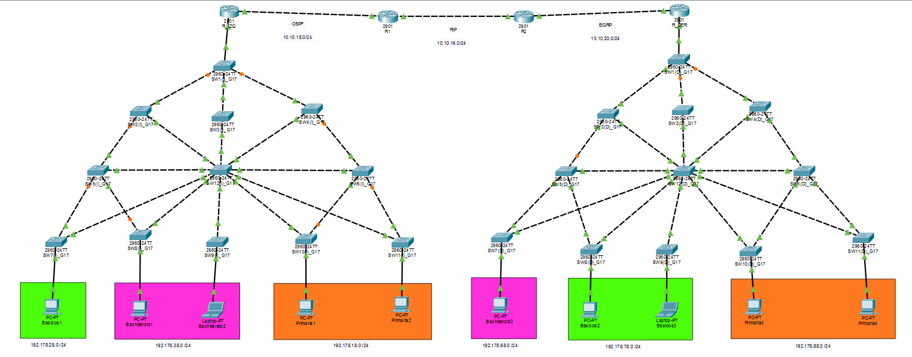
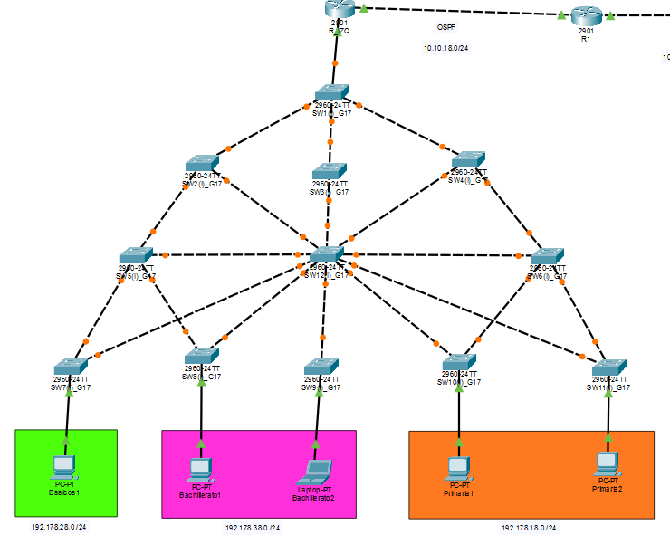
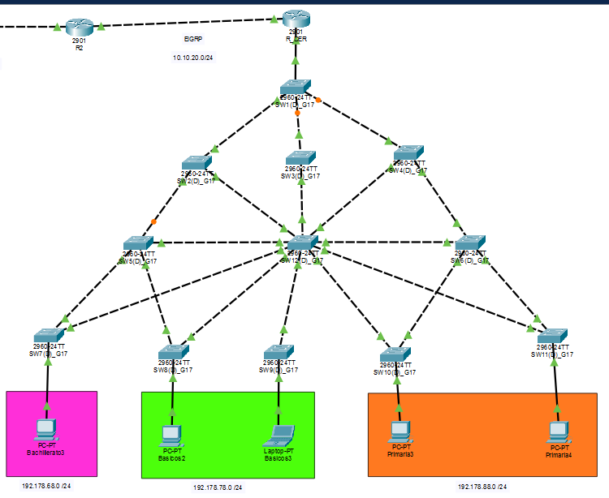

# Documentación de la Práctica 1 - Redes de Computadoras 2

## 1. Información general

- Curso: Redes de Computadoras 2
- Sección: N
- Grupo: 17
- Integrantes:
  - Christian Alexander Ochoa Orozco - 202003011
  - Isamir Alessandro Armas Cano - 201901403
  - Carlos Daniel Catalán Catalán - 201520557

## 2. Objetivo de la práctica

Implementar una topología de red con VLANs, VTP, STP, enrutamiento inter-VLAN y protocolos dinámicos de ruteo (OSPF, RIP y EIGRP), con la finalidad de lograr conectividad end-to-end entre los distintos segmentos de la red.

## 3. Topología propuesta

La práctica está dividida en dos lados:

- Lado izquierdo:
  - Switch12 como servidor VTP
  - Switch1 a Switch11 como clientes VTP
  - Router R-IZQ para inter-VLAN routing
  - Enrutamiento dinámico con OSPF, RIP y EIGRP entre routers

- Lado derecho:
  - Se continúa la propagación de rutas con protocolos dinámicos entre los routers intermedios y el router de acceso derecho

### Diagrama lógico

```text
[Switch12]---[Switch1-11]
    |
   [R-IZQ]
      |
    [R1]---[R2]---[R_DER]
```

## 4. Diseño de VLANs

Se configuraron tres VLAN principales en el dominio VTP:

| VLAN | Nombre       | Uso                                 |
| ---- | ------------ | ----------------------------------- |
| 18   | Primaria     | Segmento de alumnos de primaria     |
| 28   | Basicos      | Segmento de alumnos básicos         |
| 38   | Bachillerato | Segmento de alumnos de bachillerato |

## 5. Configuración de VTP

### Switch12 (modo servidor)

```bash
enable
configure terminal
vtp version 2
vtp mode server
vtp domain G17
vtp password redes2grupo17B
end
```

### Switch1-11 (modo cliente)

```bash
enable
configure terminal
vtp version 2
vtp mode client
vtp domain G17
vtp password redes2grupo17B
end
```

### Resultado esperado

El dominio VTP `G17` se propaga a todos los switches clientes, permitiendo que las VLAN definidas en el servidor se distribuyan automáticamente a los clientes.

## 6. Configuración de enlaces trunk

Se habilitaron enlaces trunk en los switches para permitir la propagación de VLANs en toda la topología.

Ejemplo de configuración en un switch:

```bash
interface range fa0/1-10
switchport mode trunk
switchport trunk allowed vlan all
```

Se aplicó en:

- Switch12
- Switch1 a Switch11

## 7. Configuración de puertos de acceso

Se asignaron puertos de acceso para cada segmento de usuario:

| Switch   | Puerto | VLAN |
| -------- | ------ | ---- |
| Switch7  | fa0/3  | 28   |
| Switch8  | fa0/3  | 38   |
| Switch9  | fa0/2  | 38   |
| Switch10 | fa0/3  | 18   |
| Switch11 | fa0/3  | 18   |

## 8. Configuración de STP (PVST)

Se configuró PVST en los switches para evitar bucles en la capa 2.

```bash
enable
conf terminal
spanning-tree mode pvst
```

### Root Bridge principal

- Switch12

```bash
spanning-tree vlan 18,28,38 root primary
```

### Root Bridge secundario

- Switch1

```bash
spanning-tree vlan 18,28,38 root secondary
```

### Portfast y BPDU Guard

Se habilitaron en los puertos de acceso para acelerar la convergencia y reforzar la seguridad:

```bash
interface fa0/3
spanning-tree portfast
spanning-tree bpduguard enable
```

## 9. Configuración del router izquierdo (R-IZQ)

El router izquierdo se configuró para realizar el routing inter-VLAN usando subinterfaces 802.1Q.

```bash
enable
configure terminal
interface g0/1
no shutdown
exit
interface g0/1.18
encapsulation dot1Q 18
ip address 192.178.18.1 255.255.255.0
exit
interface g0/1.28
encapsulation dot1Q 28
ip address 192.178.28.1 255.255.255.0
exit
interface g0/1.38
encapsulation dot1Q 38
ip address 192.178.38.1 255.255.255.0
exit
```

## 10. Configuración del enrutamiento dinámico

### Router R-IZQ

- Interfaz de conexión hacia la red interna:
  - `10.10.18.1/24`
- Protocolo OSPF:

```bash
router ospf 1
router-id 1.1.1.1
network 10.10.18.0 0.0.0.255 area 0
network 192.178.18.0 0.0.0.255 area 0
network 192.178.28.0 0.0.0.255 area 0
network 192.178.38.0 0.0.0.255 area 0
```

### Router R1

Se configuran ambos lados del router:

- Lado izquierdo con OSPF
- Lado derecho con RIP

```bash
interface GigabitEthernet0/1
ip address 10.10.18.2 255.255.255.0
no shutdown
exit

router ospf 1
router-id 2.2.2.2
network 10.10.18.0 0.0.0.255 area 0
redistribute rip subnets
exit

interface GigabitEthernet0/0
ip address 10.10.19.1 255.255.255.0
no shutdown
exit

router rip
version 2
no auto-summary
network 10.10.19.0
redistribute ospf 1 metric 5
exit
```

### Router R2

- Lado izquierdo usa RIP
- Lado derecho usa EIGRP

```bash
interface GigabitEthernet0/1
ip address 10.10.19.2 255.255.255.0
no shutdown
exit

router rip
version 2
no auto-summary
network 10.10.19.0
redistribute eigrp 100 metric 5
exit

interface GigabitEthernet0/0
ip address 10.10.20.1 255.255.255.0
no shutdown
exit

router eigrp 100
network 10.10.20.0 0.0.0.255
no auto-summary
redistribute rip metric 10000 100 255 1 1500
exit
```

### Router R_DER

```bash
enable
configure terminal
interface GigabitEthernet0/1
ip address 10.10.20.2 255.255.255.0
no shutdown
exit

router eigrp 100
network 10.10.20.0 0.0.0.255
network 192.178.68.0 0.0.0.255
network 192.178.78.0 0.0.0.255
network 192.178.88.0 0.0.0.255
no auto-summary
exit
```

## 11. Tabla de direcciones IP

### Lado izquierdo

| Equipo        | VLAN | Dirección IP  | Gateway      |
| ------------- | ---- | ------------- | ------------ |
| Basicos1      | 28   | 192.178.28.10 | 192.178.28.1 |
| Bachillerato1 | 38   | 192.178.38.10 | 192.178.38.1 |
| Bachillerato2 | 38   | 192.178.38.11 | 192.178.38.1 |
| Primaria1     | 18   | 192.178.18.10 | 192.178.18.1 |
| Primaria2     | 18   | 192.178.18.11 | 192.178.18.1 |

### Lado derecho

| Equipo        | VLAN | Dirección IP  | Gateway      |
| ------------- | ---- | ------------- | ------------ |
| Basicos2      | 78   | 192.178.78.10 | 192.178.78.1 |
| Basicos3      | 78   | 192.178.78.10 | 192.178.78.1 |
| Bachillerato3 | 68   | 192.178.68.10 | 192.178.68.1 |
| Primaria3     | 88   | 192.178.88.10 | 192.178.88.1 |
| Primaria4     | 88   | 192.178.88.11 | 192.178.88.1 |

## 12. Verificación esperada

Para comprobar que la implementación fue exitosa, se debe verificar:

1. Que los switches formen parte del mismo dominio VTP `G17`.
2. Que las VLANs se propaguen correctamente desde `Switch12` a los switches clientes.
3. Que los enlaces trunk estén operativos.
4. Que el protocolo STP haya elegido correctamente el root bridge.
5. Que los hosts de cada VLAN puedan comunicarse con su gateway correspondiente.
6. Que existan rutas dinámicas entre las redes conectadas por OSPF, RIP y EIGRP.
7. Que el tráfico entre VLANs sea encaminado correctamente por `R-IZQ`.

## 13. Capturas de la topologia
### Figura 1. Topología de la práctica




