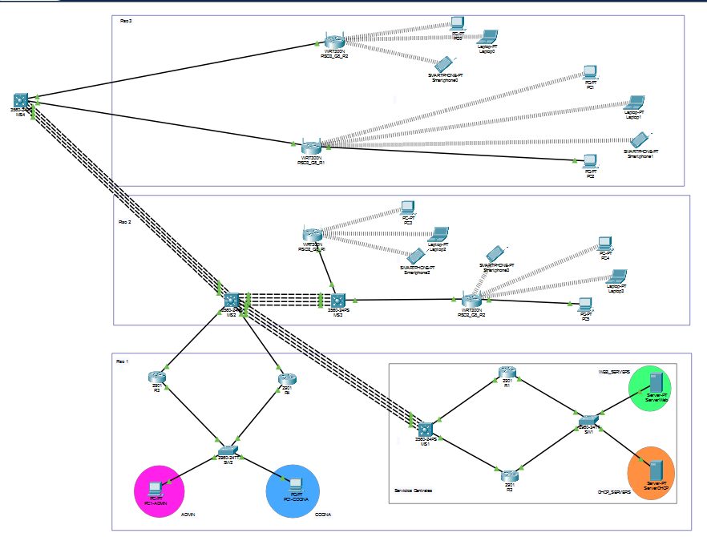
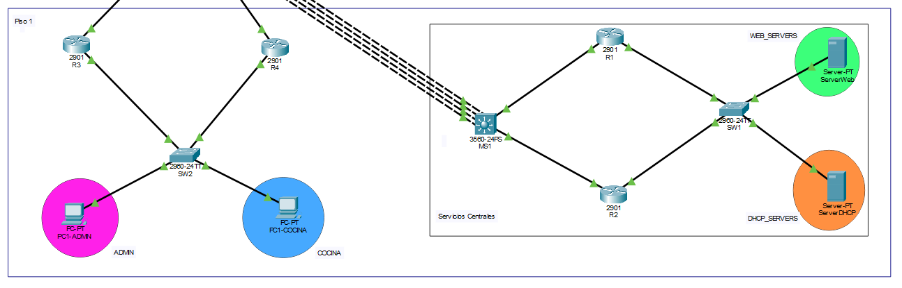
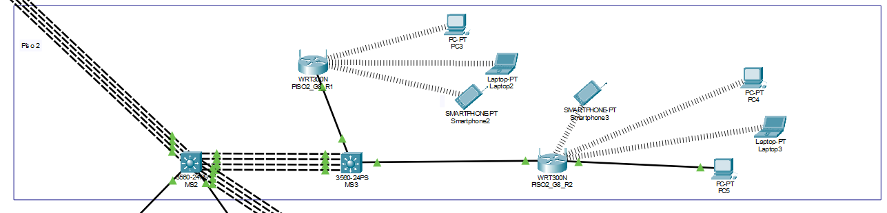
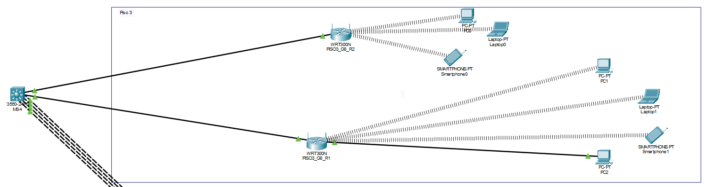

# Práctica 2 — Restaurante — Grupo 17

## Introducción

La práctica consiste en diseñar una red para un restaurante de tres pisos mediante Cisco Packet Tracer. La infraestructura integra una red cableada para las áreas de administración y cocina, cuatro redes inalámbricas distribuidas entre el segundo y tercer piso, y servicios centrales de DHCP, DNS y HTTP.

El diseño utiliza VLAN para segmentar las áreas de trabajo, EIGRP para el intercambio de rutas, LACP para la agregación de enlaces y HSRP para la redundancia de las puertas de enlace. Este manual presenta la topología, el cálculo de subredes, los parámetros de configuración y los procedimientos de verificación.


## 1. Integrantes

| Integrante | Nombre y carné |
|---|---|
| 1 | Christian Alexander Ochoa Orozco — 202003011 |
| 2 | Isamir Alessandro Armas Cano — 201901403 |
| 3 | Carlos Daniel Catalán Catalán — 201520557 |


## 2. Observaciones técnicas pendientes

1. **Direccionamiento MAN:** el esquema registrado asigna `10.2.8.32/27` al tránsito del Piso 2 y `10.2.8.36/30` y `10.2.8.40/30` al Piso 3. Estas dos últimas subredes están contenidas en el bloque del Piso 2, aunque corresponden a segmentos distintos. Es necesario contrastar las asignaciones con la configuración de los equipos y eliminar el solapamiento.
2. **Capacidad COCINA:** `/26` tiene 62 direcciones útiles. Una VIP y dos interfaces físicas HSRP dejan **59 clientes**, frente a 60 hosts solicitados. Si los 60 son terminales, hace falta ampliar y reubicar ADMIN. El [plan de correcciones](Documentacion/Revision_y_Correcciones.md) explica la alternativa.
3. **Relay DHCP:** está pendiente verificar la presencia de `ip helper-address 192.198.100.130` en las subinterfaces de clientes de R3 y R4. Este parámetro no figura en los bloques de configuración disponibles.
4. **Redes inalámbricas:** falta verificar la difusión del SSID, que debe estar desactivada en el Piso 2 y activada en el Piso 3, así como las contraseñas administrativas de los cuatro WRT. También debe aclararse el valor de X empleado en los nombres y contraseñas de la tabla inalámbrica del enunciado.
5. **HSRP:** se encuentran definidos cuatro grupos con distribución del rol activo entre cada pareja de routers. La prueba de conmutación ante fallas está pendiente en los cuatro grupos.
6. **Entrega:** archivo actual `Practica2_G17.pkt`; nombre solicitado `Practica2_17.pkt`. Carpeta actual `Practica2`; el PDF solicita `Práctica 2` en el repositorio de la práctica 1. Guardar la versión final con esos nombres al cerrar las pruebas.
7. **Método de configuración:** el enunciado exige el uso de consola. Dado que la topología incluye equipos Server-PT y WRT300N cuyos servicios se administran mediante pantallas, queda pendiente aclarar con el auxiliar el procedimiento admitido para estos dispositivos.

## 3. Topología

La siguiente figura corresponde a la topología que se utilizo para la practica.



La siguiente figura corresponde a la topología del piso 1.



La siguiente figura corresponde a la topología del piso 2.



La siguiente figura corresponde a la topología del piso 3.



La distribución lógica de los equipos se resume en el siguiente esquema. La correspondencia de nombres e interfaces se verifica mediante `show cdp neighbors` y `show ip interface brief`.

```text
Piso 3: WLAN1/WLAN2 -- WRT P3_R1/P3_R3 -- MS4
                                             |
                                         Po1, 4 enlaces
                                             |
Piso 2: WLAN1/WLAN2 -- WRT P2_R1/P2_R2 -- MS3 -- Po2, 4 enlaces -- MS2 (core)
                                                                   |       |
                                                            R3 / R4     Po3, 4 enlaces
                                                               |           |
                                                              SW2         MS1 (Datacenter)
                                                           ADMIN/COCINA    |
                                                                        R1 / R2
                                                                           |
                                                                          SW1
                                                                     Web/DNS y DHCP
```

Servicios Centrales se ubica en el Piso 1. El core MS2 enlaza las tres ramas MAN. El esquema representa conexiones lógicas.

| Switch | Puertos | Función |
|---|---|---|
| SW1 | Fa0/1; Fa0/2 | Acceso VLAN 38; acceso VLAN 48 |
| SW1 | Gi0/1–2 | Trunks a R1/R2 |
| SW2 | Fa0/1; Fa0/2 | Acceso VLAN 18; acceso VLAN 28 |
| SW2 | Gi0/1–2 | Trunks a R3/R4 |
| MS2 y MS4 | Fa0/1–4 en ambos | Po1, Piso 3–core |
| MS2 / MS3 | Fa0/5–8 / Fa0/1–4 | Po2, Piso 2–core |
| MS2 / MS1 | Fa0/11–14 / Fa0/1–4 | Po3, Datacenter–core |
| MS3 | Fa0/5–6, VLAN 100 | WAN de ambos WRT del Piso 2 |
| MS4 | Fa0/5–6 | WAN de ambos WRT del Piso 3 |


## 4. VLAN

Para calcular el direccionamiento y los identificadores de VLAN se suman los dígitos del número de grupo: `X = 1 + 7 = 8`. Al pertenecer al grupo 17, de número impar, corresponde utilizar EIGRP. Se emplea el sistema autónomo 8 para los equipos participantes.

| ID | Nombre | Uso |
|---|---|---|
| 18 | ADMIN | Administración |
| 28 | COCINA | Cocina |
| 38 | WEB_SERVERS | Web y DNS |
| 48 | DHCP_SERVERS | DHCP cableado |
| 100 | P2_WAN | Tránsito adicional del diseño hacia WRT Piso 2 |

## 5. Subnetting de usuarios y servicios

Las tablas presentan el direccionamiento inicial del proyecto, con los bloques `192.198...` establecidos en el enunciado.

### VLSM — Piso 1

Se asigna primero el segmento mayor. Fórmula de capacidad: `2^n - 2`.

| Segmento | Demanda | Red | Máscara | Usables | Broadcast | VIP | Clientes disponibles con HSRP |
|---|---:|---|---|---|---|---|---:|
| COCINA | 60 | 192.198.18.0/26 | 255.255.255.192 | .1–.62 | 192.198.18.63 | 192.198.18.1 | **59: insuficiente para 60 terminales** |
| ADMIN | 10 | 192.198.18.64/28 | 255.255.255.240 | .65–.78 | 192.198.18.79 | 192.198.18.65 | 11 |


### FLSM — Pisos 2 y 3 y Servicios Centrales

Cada /24 se divide en dos /25: 128 direcciones, 126 útiles. Cada WLAN tiene un gateway y hasta 125 clientes, suficiente para 80.

| Segmento | Red | Máscara | Usables | Broadcast | Gateway |
|---|---|---|---|---|---|
| P2 WLAN1 | 192.198.28.0/25 | 255.255.255.128 | .1–.126 | 192.198.28.127 | 192.198.28.1 |
| P2 WLAN2 | 192.198.28.128/25 | 255.255.255.128 | .129–.254 | 192.198.28.255 | 192.198.28.129 |
| P3 WLAN1 | 192.198.38.0/25 | 255.255.255.128 | .1–.126 | 192.198.38.127 | 192.198.38.1 |
| P3 WLAN2 | 192.198.38.128/25 | 255.255.255.128 | .129–.254 | 192.198.38.255 | 192.198.38.129 |
| WEB_SERVERS | 192.198.100.0/25 | 255.255.255.128 | .1–.126 | 192.198.100.127 | 192.198.100.1 |
| DHCP_SERVERS | 192.198.100.128/25 | 255.255.255.128 | .129–.254 | 192.198.100.255 | 192.198.100.129 |

## 6. Subnetting MAN — 10.2.8.0/24

Los enlaces de dos extremos usan /30 (máscara 255.255.255.252, dos direcciones útiles). El tránsito compartido de Piso 2 usa /27 (255.255.255.224, 30 útiles). Por ello el conjunto MAN utiliza tamaños variables.

| Enlace | Red | A | B | Broadcast |
|---|---|---|---|---|
| Po1 | 10.2.8.0/30 | MS4 .1 | MS2 .2 | 10.2.8.3 |
| Po2 | 10.2.8.4/30 | MS2 .5 | MS3 .6 | 10.2.8.7 |
| Po3 | 10.2.8.8/30 | MS2 .9 | MS1 .10 | 10.2.8.11 |
| MS2 Fa0/9–R3 Gi0/0 | 10.2.8.12/30 | .13 | .14 | 10.2.8.15 |
| MS2 Fa0/10–R4 Gi0/0 | 10.2.8.16/30 | .17 | .18 | 10.2.8.19 |
| MS1 Gi0/1–R1 Gi0/0 | 10.2.8.20/30 | .21 | .22 | 10.2.8.23 |
| MS1 Gi0/2–R2 Gi0/0 | 10.2.8.24/30 | .25 | .26 | 10.2.8.27 |
| Tránsito compartido P2 | **10.2.8.32/27** | MS3 .33 | WRT .34 y .35 | 10.2.8.63 |
| MS4 Fa0/5–P3_R1 WAN | **10.2.8.36/30** | .37 | .38 | 10.2.8.39 |
| MS4 Fa0/6–P3_R3 WAN | **10.2.8.40/30** | .41 | .42 | 10.2.8.43 |

## 7. HSRP y gateways

Los clientes usan la VIP, no la IP física de un router. Cada pareja comparte VLAN y VIP. El activo preferido tiene prioridad 110 y el otro 100; ambos incluyen `preempt`.

| Grupo/VLAN | VIP | Router / IP / rol preferido | Router / IP / rol preferido |
|---|---|---|---|
| 18 | 192.198.18.65 | R3 .66 Standby | R4 .67 Active |
| 28 | 192.198.18.1 | R3 .2 Active | R4 .3 Standby |
| 38 | 192.198.100.1 | R1 .3 Active | R2 .4 Standby |
| 48 | 192.198.100.129 | R1 .131 Standby | R2 .132 Active |

El siguiente bloque corresponde al grupo HSRP 28 en R3. Las configuraciones de las cuatro unidades se presentan en las secciones 8 y 9 

```cisco
enable
configure terminal
interface gigabitEthernet0/1.28
 encapsulation dot1Q 28
 ip address 192.198.18.2 255.255.255.192
 standby 28 ip 192.198.18.1
 standby 28 priority 110
 standby 28 preempt
end
show standby brief
show standby
```

Ante una falla del router activo o de su enlace LAN, el router de respaldo debe asumir la puerta de enlace virtual. La detección de una falla exclusiva del enlace WAN requiere seguimiento de interfaz, cuya configuración está pendiente de verificar. Al restablecer el router de mayor prioridad, se comprueban la recuperación del rol activo mediante `preempt` y la continuidad del tráfico.

## 8. DHCP y WiFi

### DHCP central cableado

ServerDHCP: `192.198.100.130/25`, gateway `192.198.100.129`, DNS `192.198.100.2`. Servicio DHCP habilitado. Los servidores e interfaces de infraestructura tienen direcciones estables; los clientes finales reciben DHCP.

| Pool | Máscara | Inicio | Final | Máximo | Gateway | DNS |
|---|---|---|---|---:|---|---|
| POOL_ADMIN | 255.255.255.240 | 192.198.18.68 | 192.198.18.78 | 11 | 192.198.18.65 | 192.198.100.2 |
| POOL_COCINA | 255.255.255.192 | 192.198.18.4 | 192.198.18.62 | 59 | 192.198.18.1 | 192.198.100.2 |

Los rangos excluyen las direcciones reservadas para HSRP: `.65–.67` en ADMIN y `.1–.3` en COCINA. La ampliación propuesta para COCINA requiere actualizar los pools y las subinterfaces de ambos routers.

El relay reenvía las solicitudes DHCP desde la VLAN cliente al servidor remoto. Debe comprobarse en **R3 y R4** para ambas VLAN. 

La configuración requerida para el relay es la siguiente. Su presencia debe verificarse en ambos routers antes de aplicar cambios.

```cisco
enable
configure terminal
interface gigabitEthernet0/1.18
 ip helper-address 192.198.100.130
exit
interface gigabitEthernet0/1.28
 ip helper-address 192.198.100.130
end
```

### DHCP local en cada WRT

| WRT | LAN/gateway /25 | Inicio DHCP | Final DHCP | Máximo documentado | DNS |
|---|---|---|---|---:|---|
| P2_R1 | 192.198.28.1 | 192.198.28.2 | 192.198.28.126 | 125 | 192.198.100.2 |
| P2_R2 | 192.198.28.129 | 192.198.28.130 | 192.198.28.254 | 125 | 192.198.100.2 |
| P3_R1 | 192.198.38.1 | 192.198.38.2 | 192.198.38.126 | 125 | 192.198.100.2 |
| P3_R3 | 192.198.38.129 | 192.198.38.130 | 192.198.38.254 | 125 | 192.198.100.2 |

Cada WRT proporciona el servicio DHCP de su propia WLAN, mientras que el servidor central atiende las VLAN cableadas. Durante la verificación se debe comprobar que cada pool inalámbrico permita asignar direcciones a por lo menos 80 clientes.

Las interfaces WAN del Piso 2 utilizan `.34` y `.35`, máscara /27 y gateway `.33`. En el Piso 3 se emplean `.38` y `.42`, máscara /30 y gateways `.37` y `.41`, respectivamente. Todas pertenecen al bloque `10.2.8.0/24`. El tránsito del Piso 2 está sujeto a la corrección de solapamiento descrita anteriormente. Se contempla el modo Router en los WRT, con verificación de rutas de retorno y comunicación en ambos sentidos.

### Parámetros inalámbricos

| Piso | SSID | Seguridad | Clave WiFi | Broadcast requerido | Clave administrativa si X=8 |
|---|---|---|---|---|---|
| 2 | PISO2_G8_R1 / PISO2_G8_R2 | WPA2-Personal, AES | G8_PISO2 | Desactivado | Grupo8_P2 |
| 3 | PISO3_G8_R1 / PISO3_G8_R3 | WPA2-Personal, AES | G8_PISO3 | Activado | Grupo8_P3 |


Los parámetros se consultan en WRT → GUI → Setup/Basic Setup (WAN, LAN, DHCP y DNS), Advanced Routing (modo de operación), Wireless/Basic Wireless Settings (SSID y broadcast), Wireless Security (WPA2/AES) y Administration/Management (contraseña administrativa). 

## 9. EIGRP y LACP

En MS1–MS4 se requiere `ip routing`. Los enlaces Po1–Po3 son interfaces de capa 3 (`no switchport`) con cuatro puertos físicos cada uno, configurados con `channel-group N mode active` en ambos extremos. No son trunks de usuarios.

Ejemplo MS2–MS1, Datacenter:

```cisco
enable
configure terminal
ip routing
interface port-channel 3
 no switchport
 ip address 10.2.8.9 255.255.255.252
exit
interface range fastEthernet0/11-14
 no switchport
 channel-group 3 mode active
 no shutdown
end
show etherchannel summary
```

MS1 usa Po3 `.10` y Fa0/1–4. Po1 usa MS4 `.1` / MS2 `.2`; Po2 usa MS2 `.5` / MS3 `.6`.

EIGRP AS 8 conecta routers y multilayer. Ejemplo del core:

```cisco
enable
configure terminal
router eigrp 8
 network 10.2.8.0 0.0.0.3
 network 10.2.8.4 0.0.0.3
 network 10.2.8.8 0.0.0.3
 network 10.2.8.12 0.0.0.3
 network 10.2.8.16 0.0.0.3
 no auto-summary
end
```

MS1 anuncia los enlaces `.8/30`, `.20/30`, `.24/30`; MS4 `.0/30`, `.36/30`, `.40/30`; MS3 `.4/30` y su tránsito P2. R1–R4 anuncian sus /30 y subredes LAN, `network` selecciona interfaces locales; la máscara wildcard no cambia la máscara de la interfaz. La línea estrecha `network 10.2.8.32 0.0.0.3` selecciona la SVI `.33`.

Rutas estáticas documentadas hacia las LAN de los WRT, redistribuidas mediante `redistribute static` en EIGRP:

```cisco
! MS3, diseño documentado antes de corregir tránsito
ip route 192.198.28.0 255.255.255.128 10.2.8.34
ip route 192.198.28.128 255.255.255.128 10.2.8.35
! MS4
ip route 192.198.38.0 255.255.255.128 10.2.8.38
ip route 192.198.38.128 255.255.255.128 10.2.8.42
```

La propagación se verifica en las tablas de enrutamiento: las rutas estáticas se identifican con `S` en el equipo de origen y con `D EX` en los equipos que las reciben mediante redistribución. Las rutas EIGRP internas aparecen con `D`. Cuando una ruta no se propaga, se revisan el siguiente salto, la redistribución y la métrica.

## 10. DNS, HTTP y contenido

ServerWeb: IP `192.198.100.2`, máscara `255.255.255.128`, gateway `192.198.100.1`, DNS `192.198.100.2`. Conectado a SW1 Fa0/1, VLAN 38.

| Servicio | Configuración a acreditar |
|---|---|
| DNS | Activado; registro A `www.practica2_Grupo17.com` → `192.198.100.2` |
| HTTP | Activado; `index.html` guardado con datos reales de integrantes y grupo 17 |
| Clientes | DNS recibido por DHCP `192.198.100.2` |
| Validación | Abrir `http://www.practica2_Grupo17.com` desde los tres pisos |

La configuración del servidor se consulta en Desktop → IP Configuration, Services → DNS y Services → HTTP.

## 11. Comandos utilizados y respaldo

Los siguientes comandos permiten consultar el estado de los equipos y comprobar los servicios de red:

```cisco
enable
show running-config
show ip interface brief
show cdp neighbors
show vlan brief
show interfaces trunk
show etherchannel summary
show ip protocols
show ip eigrp neighbors
show ip route
show standby brief
show standby
```

Usar cada comando en el tipo de equipo correspondiente: VLAN/trunks en switches, EtherChannel en multilayer, HSRP en R1–R4. Guardar después de restaurar las fallas de prueba:

```cisco
copy running-config startup-config
```

El nombre de destino se acepta con Enter.
